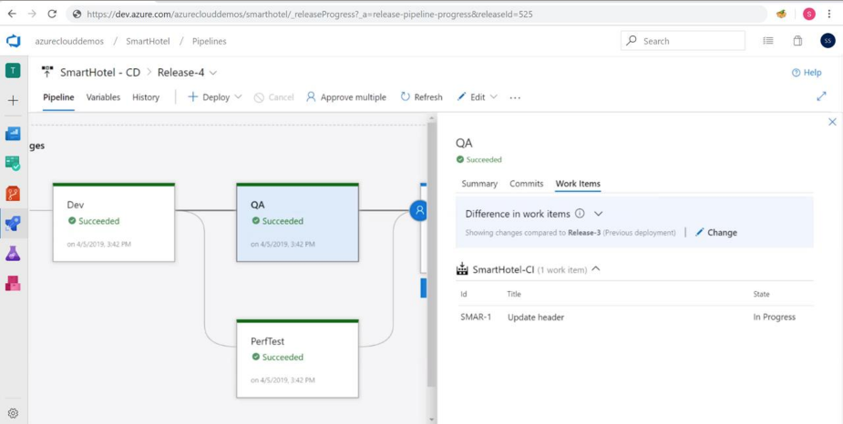
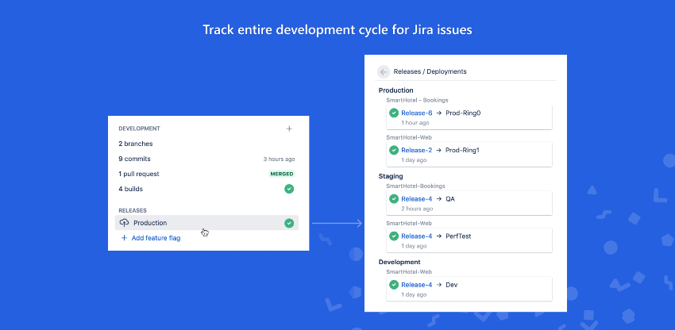
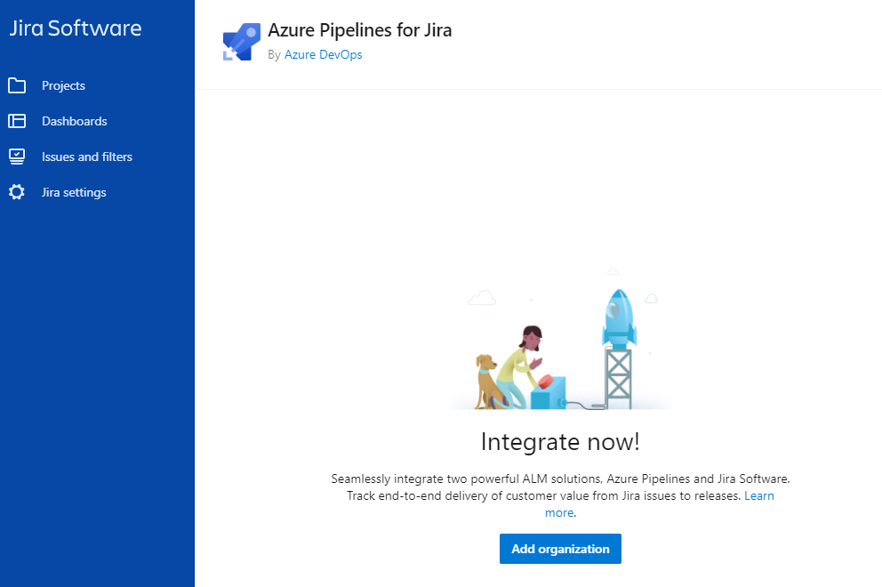
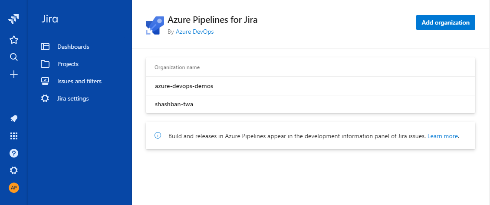
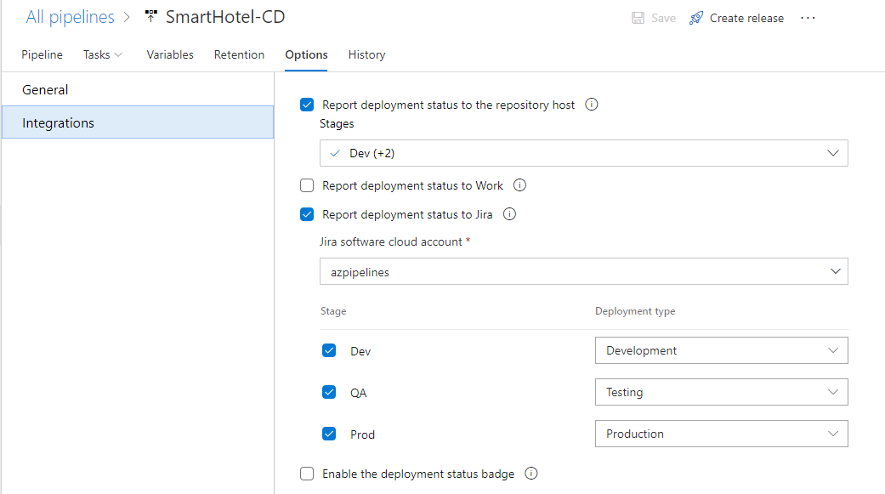
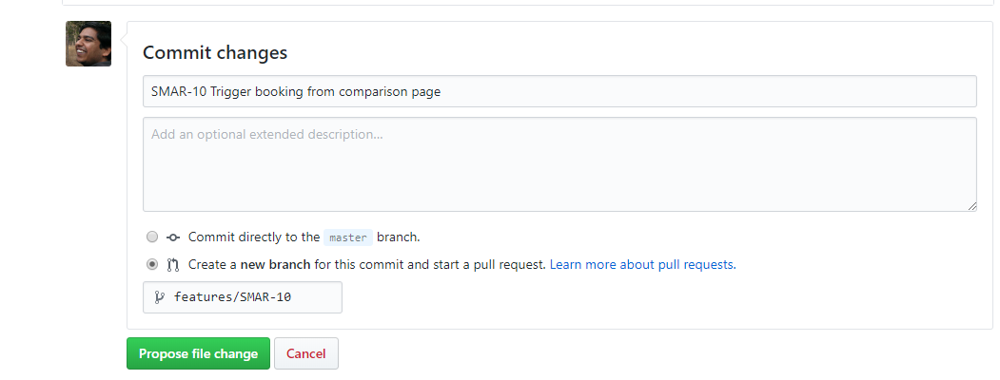
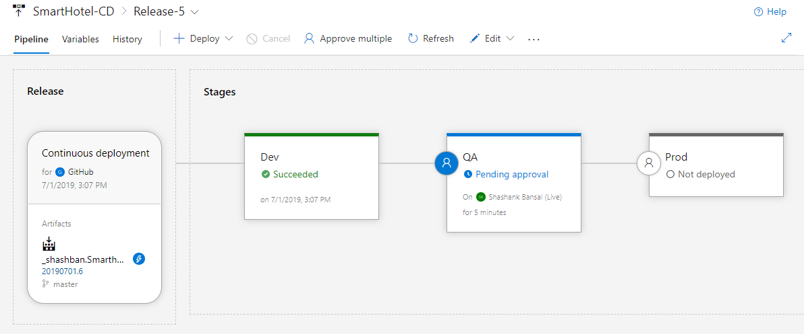
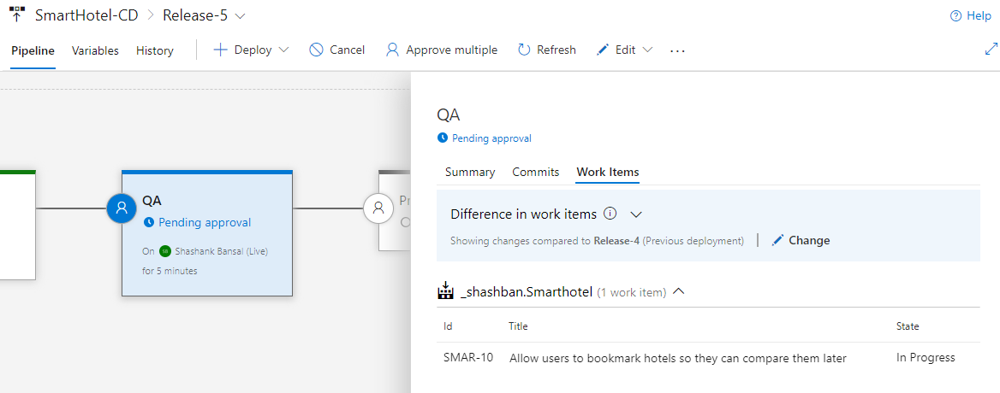
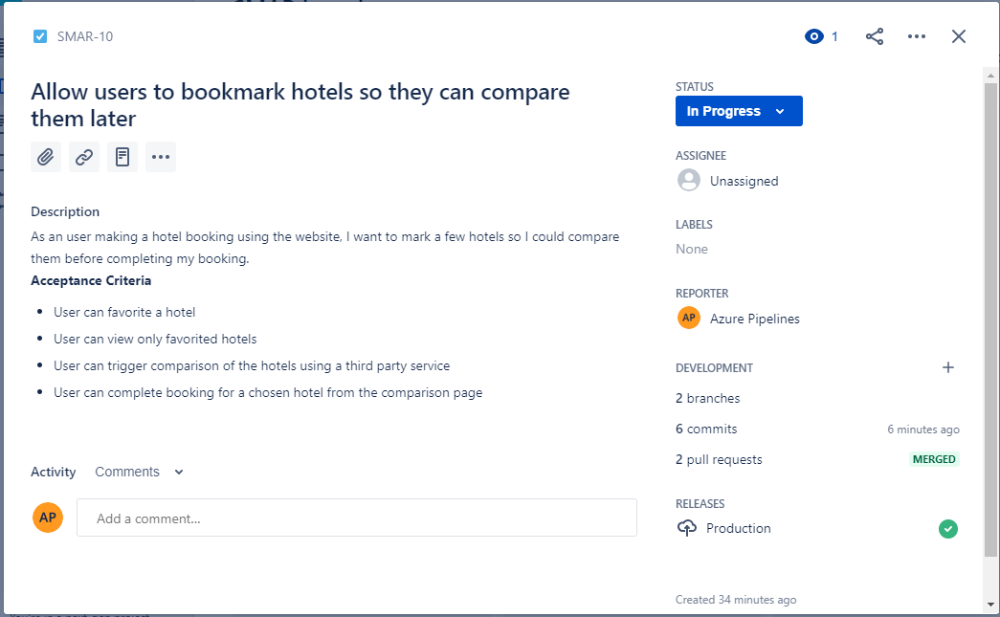
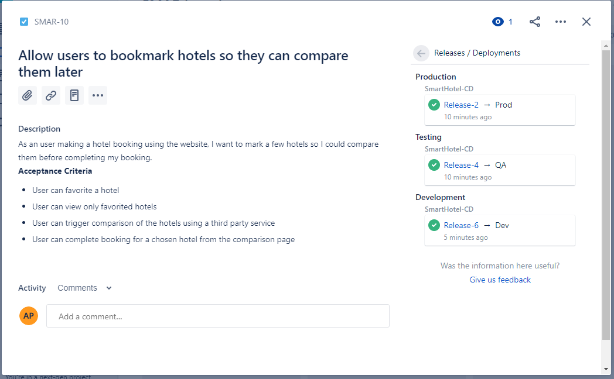

# **Integrate with Jira Issue tracking**

Teams often use multiple tools and services in their DevOps workflows. Azure DevOps believes in giving you, the users a choice of 
tool for all parts of the pipeline without impacting the bidirectional flow of information for E2E traceability.

Azure Pipelines and Atlassian partner together to bring an integration of Azure Pipelines with Jira software cloud. The integration adds links to Jira issues as work items deployed with the pipeline and enables you to view deployment details from Pipelines directly in Jira issues. You can now automatically include Jira issues in release notes, and you can completely track delivery of issues without leaving Jira.

|  |  |
|------------------------------------------|------------------------------------------|

This tutorial provides a step by step guide for connecting Azure Pipelines with Jira software cloud and enabling communication between the services.

## **Prerequisites**

This tutorial assumes the team is using the following tools in their DevOps pipeline.

[GitHub for Jira](https://marketplace.atlassian.com/apps/1219592/github-for-jira?hosting=cloud&tab=overview) application must be installed and configured to enable use of [smart commits](https://confluence.atlassian.com/fisheye/using-smart-commits-298976812.html?_ga=2.264408203.506527647.1561969087-650469135.1561969087) in GitHub.

## **Connecting Azure Pipelines and Jira Cloud**

The first step to get started is to connect the two services together.

1. Install the [Azure Pipelines for Jira](https://marketplace.atlassian.com/apps/1220515/azure-pipelines-for-jira?hosting=cloud&tab=overview) application from the Atlassian marketplace
1. On the post installation page, start adding your Azure DevOps organization and complete the wizard.
    
1. On successful completion, the organization would be listed for the application.
    

## **Configuring the release pipeline**

The next step is to inform the release pipeline to interact with Jira cloud for issue tracking.

1. In the release pipeline configured for continuous delivery of the project, enable “report deployment status to Jira” and provide a mapping of the stages to deployment type.

    

## **Get it working**

Let us see it in action E2E.

1. Make a smart commit in GitHub referring a Jira issue.

    

1. It would automatically trigger the CI/CD pipeline in Azure Pipelines.

    

1. View the work items included in this deployment. Jira issues would be listed automatically.

    

1. In the Jira issue, the releases section informs the highest environment the issue has been deployed to.

    

1. You can also see latest deployments to each environment for the issue.

    

## **FAQs**

- How do I add another Jira cloud instance to my Azure DevOps account?
The integration is triggered from Jira software cloud only. To add another instance to your Azure DevOps account, install the app on the instance and add the Azure DevOps organization to it.

- Can I add multiple Azure DevOps organizations to a Jira cloud instance?
Yes. You can configure the integration for multiple Azure DevOps organization from the manage application page in Jira cloud.

- How do I add another project in a pre-configured organization to the integration?
Use the add organization button to add additional projects in organizations already configured for the integration.

- The information flow is not working. What should I do?
Try by removing the organization from Jira cloud and reconfiguring the integration. You may need to update the release pipeline as well. Data for existing releases would not be impacted by this.

- Can I also see builds performed by Azure Pipelines in Jira?
The integration currently supports traceability for deployments (releases) only. Viewing build information in Jira is not supported.
